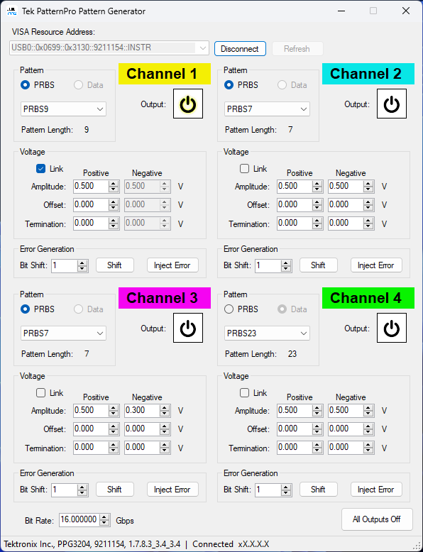

# Tek PatternPro Generator
<picture>
  <source media="(prefers-color-scheme: dark)" srcset="https://theme.tekcloud.com/prod/github/tek-logo-round-dark-mode.png" width="100px">
  <source media="(prefers-color-scheme: light)" srcset="https://theme.tekcloud.com/prod/github/tek-logo-round-light-mode.png" width="100px">
  
</picture>

 

A simple GUI application for controlling Tektronix PatternPro Generators from a PC.

<picture>
 
</picture>

## Prerequisites
* PC equipped with Supported Microsoft Windows Operating System
  * Windows 7 32-bit or 64-bit
  * Windows 8.1 32-bit or 64-bit
  * Windows 10 32-bit or 64-bit
  * 4GB RAM or more.
* VISA (Virtual Instrument Software Architecture) software supporting the VISA.NET library.
  * [NI VISA](http://www.ni.com/download/ni-visa-run-time-engine/7222/en/) is recommended
* [.NET Framework 4.7.2](https://dotnet.microsoft.com/en-us/download/dotnet-framework/net472)

## Supported Instruments
The following Instruments are supported by this software.
* [Tektronix PatternPro PPG Series Pattern Generators](https://www.tek.com/en/products/bit-error-rate-tester/patternpro-ppg-series-pattern-generator)

## Building the project
The Tek PatternPro Generator project is written in C# using Visual Studio.  To build the project, simply open the solution file in Visual Studio then build the project.

**Note:** You may need to update the project reference to your local copy of Ivi.Visa.

## Contribute

See a typo? Know how to fix an issue? Implement a requested feature?

We'd love to accept your patches and contributions! The [Contributing](CONTRIBUTING.md) document guides you through adding and submitting your contributions.

## Maintainer

* [David Wyban](https://github.com/dwyban)

## Disclaimer

This is not an officially supported Tektronix product. It is maintained by a small group of employees in their spare time. We lack the resources typical of most Tektronix products, so please bear with us! We will do our best to address your issues and answer any questions directly related to this extension in a timely manner.

## License

"The code in this project is licensed under Apache 2.0"

## Contributor License Agreement

Contributions to this project must be accompanied by a Contributor License Agreement. You (or your employer) retain the copyright to your contribution; this simply gives us permission to use and redistribute your contributions as part of the project.

You generally only need to submit a CLA once, so if you've already submitted one (even if it was for a different project), you probably don't need to do it again.
